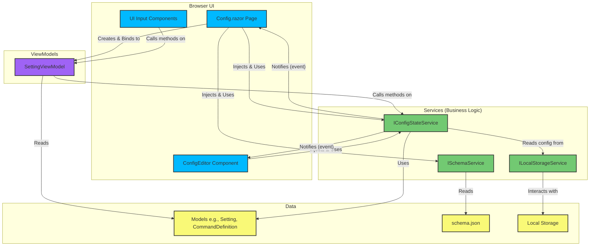

# CSConfigGenerator Architecture

This document outlines the architecture of the CSConfigGenerator Blazor WebAssembly application.

## Architecture Diagram

The following diagram illustrates the primary components of the application and their interactions.

## Architectural Pattern

The application follows a modern, service-oriented architecture that adapts the **Model-View-ViewModel (MVVM)** pattern for Blazor's component-based model.

-   **Views (Components)**: The UI is composed of Razor components (`.razor`). The `Config.razor` page is the main view for displaying and interacting with settings. It is a "smart" component that coordinates with services. Other components are more presentation-focused.

-   **ViewModels**: A thin `SettingViewModel` class acts as a bridge between the UI components and the services. It holds a reference to a `CommandDefinition` (the Model) and the `IConfigStateService`, delegating all business logic to the service. This keeps the UI components clean and decoupled from the core logic.

-   **Models**: These are simple C# record types or classes (POCOs) in the `Models` directory that represent the application's data structures (e.g., `Setting`, `CommandDefinition`).

-   **Services**: The core business logic is encapsulated in services, which are registered for dependency injection.
    -   `ISchemaService`: Responsible for loading the configuration schema from underlying data sources (like `schema.json`).
    -   `IConfigStateService`: The "source of truth." It manages the complete state of the user's configuration, including all setting values. It handles validation, type conversion, and notifies the UI of any changes via a C# event (`OnStateChange`). This ensures the UI is always in sync with the application state.
    -   Other services handle cross-cutting concerns like browser local storage persistence (`ILocalStorageService`) and user notifications (`IToastService`).

## Data Flow

The data flow is unidirectional and reactive:

1.  A **View Component** (e.g., a slider for a setting) is bound to a `SettingViewModel`.
2.  When the user interacts with the component, a method on the `SettingViewModel` is called.
3.  The `SettingViewModel` immediately delegates this call to the `IConfigStateService`.
4.  The `IConfigStateService` updates its internal state (e.g., changes a setting's value).
5.  After updating its state, the `IConfigStateService` invokes the `OnStateChange` event.
6.  The `Config.razor` page and other high-level components subscribe to this event. When the event is fired, they call `StateHasChanged()` to trigger a re-render, ensuring the entire UI reflects the new state.

This centralized, event-driven state management pattern makes the application predictable, scalable, and easy to debug. The `ConfigEditor` component, for example, listens to the same `OnStateChange` event to provide a real-time view of the generated configuration file.
